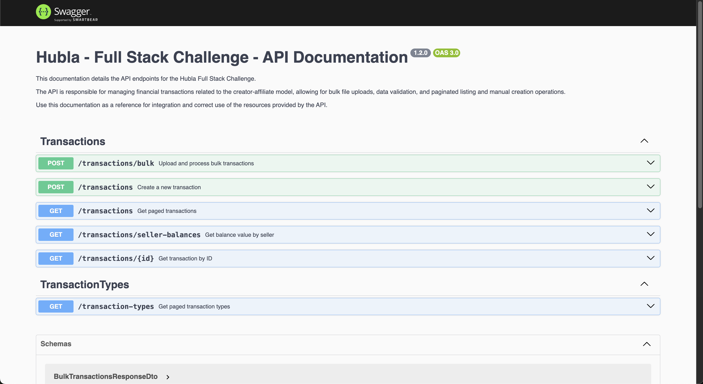
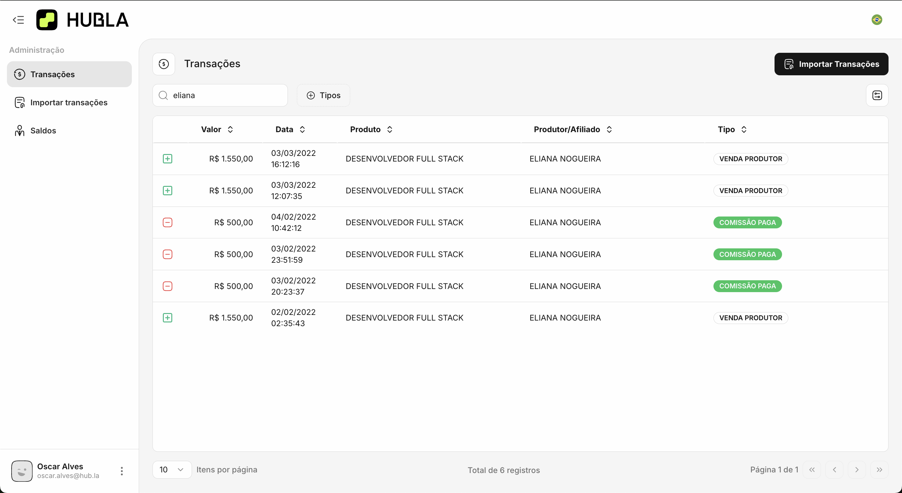
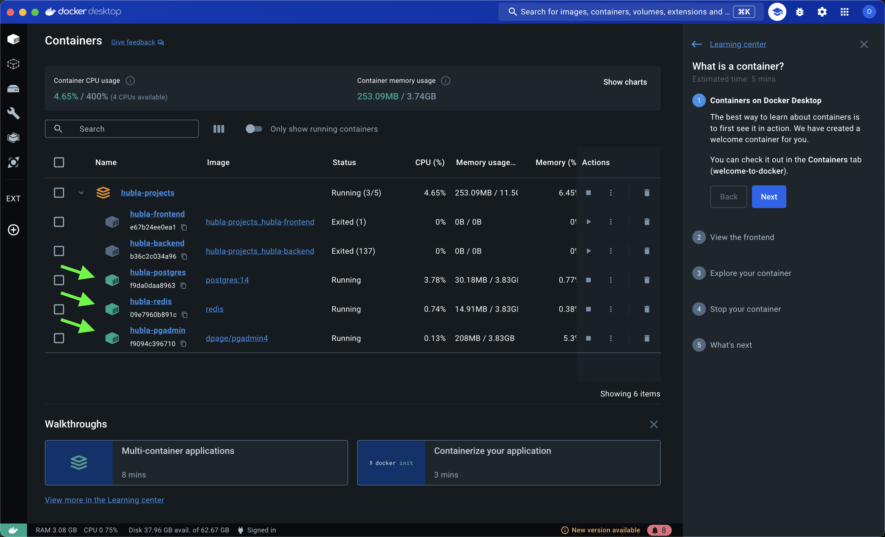
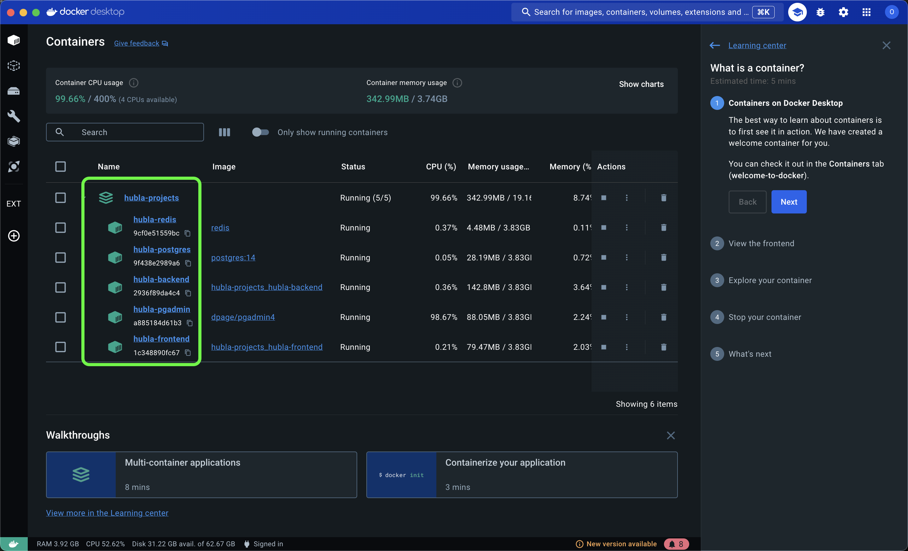

# Hubla - Desafio Programação Full Stack v1.2.0

## Sumário

- [Introdução](#introdução)
- [Apresentação em vídeo](#apresentação-em-vídeo)
- [Tecnologias Utilizadas](#tecnologias-utilizadas)
  - [Backend](#backend)
  - [Frontend](#frontend)
- [Requisitos](#requisitos)
- [Executar o Ambiente de Desenvolvimento](#executar-o-ambiente-de-desenvolvimento)
- [Executar Local o Ambiente de Produção](#executar-local-o-ambiente-de-produção)
- [Autenticação](#autenticação)
- [Estrutura do Repositório](#estrutura-do-repositório)
- [Backend](#backend-1)
  - [Prisma Schema](#prisma-schema)
  - [Swagger Documentation](#swagger-documentation)
  - [Comandos do Prisma](#comandos-do-prisma)
  - [Testes](#testes)
- [Frontend](#frontend-1)
  - [SSR e Client Components](#ssr-e-client-components)
  - [Dicionários Multilíngues](#dicionários-multilíngues)
  - [Configuração de Temas (Light/Dark)](#configuração-de-temas-lightdark)
  - [Estrutura do Repositório (Frontend)](#estrutura-do-repositório-frontend)
- [Backlog de Atividades](#backlog-de-atividades)
  - [Atividades Realizadas](#atividades-realizadas)
  - [Atividades Desejáveis (pendentes)](#atividades-desejáveis-pendentes)

---

## Introdução

Este repositório é um monorepo que contém dois projetos principais, projetados para oferecer uma solução completa e robusta:

1. **Hubla Backend:** Uma poderosa API desenvolvida com NestJS, Prisma, PostgreSQL e Redis proporcionando uma arquitetura escalável, modular e segura para gerenciar transações e dados essenciais.
2. **Hubla Frontend:** Uma interface moderna e dinâmica construída com React, Next.js, Tailwind CSS, Shadcn UI e Auth.js.

| Backend | Frontend |
| --- | --- |
|  |  |

Este documento detalha as instruções para configurar e executar o ambiente tanto em modo de desenvolvimento quanto em modo de produção, além de fornecer descrições sobre comandos essenciais do Prisma e o acesso à documentação Swagger para facilitar a integração e uso da API.

## Apresentação em vídeo

| Vídeo | Link de arquivo .MP4 |
| --- | --- |
| **Apresentação do projeto** | <a href="https://github.com/oskaralves/hubla-fullstack-challenge/raw/refs/heads/desafio/docs/apresentacao-projeto-desafio-hubla.mp4" target="_blank">Clique aqui para assistir</a> |

---

## **Requisitos**

Antes de iniciar, certifique-se de que você tem os seguintes softwares instalados:

| Logo | Nome | Link |
| --- | --- | --- |
|  | Docker | [Instalar Docker](https://www.docker.com/) |
|  | Docker Compose | [Instalar Docker Compose](https://docs.docker.com/compose/) |
|  | Node.js | [Instalar Node.js](https://nodejs.org/) (versão 18 ou superior) |
|  | Yarn | [Instalar Yarn](https://yarnpkg.com/) |
|  | Turborepo | [Instalar Turborepo](https://turbo.build/) |

---

## Autenticação

Para realizar testes na API, disponibilizamos duas formas principais de interação:

### 1. Arquivos Postman

Fornecemos arquivos de configuração para facilitar o uso do Postman, permitindo que você importe as rotas diretamente em sua workspace.

| Arquivo | Link de Download |
| --- | --- |
| **Collection - Hubla Full Stack - v1.2.0** | [Baixar Collection](docs/postman/hubla-dev.postman_environment.json) |
| **Environment - HublaDev** | [Baixar Environment](docs/postman/hubla-dev.postman_environment.json) |

### 2. Swagger

Além disso, a API possui suporte ao **Swagger**, permitindo que você visualize e interaja diretamente com as rotas através de uma interface web amigável.

---

## **Tecnologias Utilizadas**

### Backend

| Logo | Nome | Descrição |
| --- | --- | --- |
|  | Node.js | Framework para criação de APIs robustas |
|  | Nest.js | Framework para criação de APIs robustas |
|  | Prisma | ORM para gerenciamento de banco de dados |
|  | PostgreSQL | Banco de dados relacional |
|  | Redis | Cache rápido e banco de dados em memória |
|  | Jest | Bilbioteca para testes |
|  | Docker | Contêineres para desenvolvimento e deploy |

---

### Frontend

| Logo | Nome | Descrição |
| --- | --- | --- |
|  | Next.js | Framework para SSR e SSG |
|  | React | Biblioteca para construção de interfaces |
|  | Tailwind CSS | Framework de estilização utilitária |
|  | Shadcn UI | Componentes de UI modernos |
|  | Jest | Bilbioteca para testes |
|  | Auth.js | Authentication for the Web |
|  | Docker | Contêineres para desenvolvimento e deploy |

---

## **Executar o Ambiente de Desenvolvimento**

### 1. Subir o ambiente com Docker Compose

 Na raiz do monorepo, execute:

```bash
# Subir apenas os serviços necessários para desenvolvimento
yarn docker:dev
```

Este comando utiliza o arquivo `docker-compose.dev.yml` para configurar os seguintes serviços:

- **PostgreSQL**: Banco de dados na porta `5432`.
- **pgAdmin**: Interface para gerenciar o PostgreSQL, acessível em `http://localhost:16543`.
- **redis**: Interface para gerenciar cache e dados em memoria, na porta `6379`.

### 2. Script do Prisma Generate

```bash
yarn prisma:generate
```

Este comando executa o script configurado no `package.json` do `hubla-backend` para preparar o banco de dados e gerar o cliente do Prisma. O script realiza as seguintes etapas:

1. Aplicar Migrações ao Banco de Dados `npx prisma migrate deploy` Sincroniza as migrações com o banco de dados, criando ou atualizando as tabelas conforme necessário.
2. Seed do Banco de Dados `yarn prisma:seed` Popula o banco de dados com dados iniciais, úteis para desenvolvimento ou testes.
3. Gerar o Prisma Client `npx prisma generate` Cria os arquivos necessários para que o Prisma interaja com o banco de dados usando TypeScript.

> Após a execução, o Prisma estará totalmente configurado para uso no projeto, com o banco de dados atualizado e pronto para uso/consultas.

### 3. Rodar os apps local (Mais rápido)

####

```bash
# Primeiro terminal: Executar o backend
cd apps/hubla-backend/
yarn start:dev
```

```bash
# Segundo terminal: Construir e executar o frontend
cd apps/hubla-frontend/
yarn build && yarn start
```

### 4. Rodar os apps (com Hot Reload)

Caso precise alterar algum arquivo durante o desenvolvimento e ver as alterações em tempo real:

```bash
yarn dev:all
```

#### **:rocket: Agora** Acesse os links:

1. http://localhost:3000
2. http://localhost:3010/docs

Para encerrar os contêineres:

```bash
yarn docker:down
```

---

## **Executar Local o Ambiente de Produção**

```bash
yarn docker:prod
```



Este script configura e executa os contêineres necessários para a aplicação, criando automaticamente os seguintes serviços:

- **hubla-postgres:** Banco de dados PostgreSQL, responsável pelo armazenamento de dados.
- **hubla-pgadmin:** Interface de administração do PostgreSQL, acessível em http://localhost:16543.
- **hubla-redis:** Interface para gerenciar cache e dados em memoria, na porta `6379`.
- **hubla-backend:** API do backend, disponível na porta `3010`.
- **hubla-frontend:** Aplicação frontend, acessível em http://localhost:3000.

> **Nota:** Todos os serviços são configurados automaticamente usando o arquivo docker-compose.yml no modo de produção. Após a inicialização, a aplicação estará pronta para testes ou uso final em ambiente local.

---

## Autenticação

Para realizar testes na API, disponibilizamos duas formas principais de interação:

### 1. Arquivos Postman

Fornecemos arquivos de configuração para facilitar o uso do Postman, permitindo que você importe as rotas diretamente em sua workspace.

| Arquivo | Link de Download |
| --- | --- |
| **Collection - Hubla Full Stack - v1.2.0** | [Baixar Collection](docs/postman/hubla-dev.postman_environment.json) |
| **Environment - HublaDev** | [Baixar Environment](docs/postman/hubla-dev.postman_environment.json) |

```markdown
### Admin

- email: oscar.alves@hub.la
- password: Abcd123!
```

### 2. Swagger

Além disso, a API possui suporte ao **Swagger**, permitindo que você visualize e interaja diretamente com as rotas através de uma interface web amigável.

## **Estrutura do Repositório**

```
hubla-projects/
├── apps/
│   ├── hubla-backend/     # Backend App
│   └── hubla-frontend/    # Frontend App
├── docker-compose.dev.yml # Configuração do Docker para desenvolvimento
├── docker-compose.yml     # Configuração do Docker para produção
├── package.json           # Configuração do monorepo
├── yarn.lock              # Dependências do projeto
└── README.md              # Este arquivo
```

## **Backend**

### **Prisma Schema**

O Prisma foi configurado para permitir a separação de schemas em arquivos diferentes. Aqui está um exemplo da configuração:

#### **schema.prisma**

```prisma
generator client {
  provider        = "prisma-client-js"
  previewFeatures = ["multiSchema", "prismaSchemaFolder"]
}

datasource db {
  provider = "postgresql"
  url      = env("DATABASE_URL")
  schemas  = ["public"]
}

```

#### **transaction.prisma**

```prisma
model Transaction {
    id              String          @id @default(uuid())
    type            Int
    date            DateTime
    product         String
    value           Int
    seller          String
    transactionType TransactionType @relation(fields: [type], references: [id])

    @@map("transactions")
    @@schema("public")
}
```

#### **transaction_type.prisma**

```prisma
model TransactionType {
    id           Int                   @id @default(autoincrement())
    description  String                @unique
    nature       TransactionNatureEnum
    transactions Transaction[]

    @@map("transaction_types")
    @@schema("public")
}

enum TransactionNatureEnum {
    INPUT // Entrada
    OUTPUT // Saída

    @@schema("public")
}
```

### **Swagger Documentation**

A documentação da API do backend está disponível em:

```
http://localhost:3010/docs
```

Esta documentação é gerada automaticamente com Swagger e descreve todos os endpoints, models, payload da API.

### **Comandos do Prisma**

Os comandos abaixo são usados para gerenciar o banco de dados com Prisma. Execute-os na raiz do backend (apps/hubla-backend):

#### Gerar o Prisma Client

Gera os arquivos necessários para interagir com o banco de dados.

```bash
npx prisma generate
```

#### Aplicar Migrações

Cria as tabelas e atualiza o banco de dados com base no esquema definido em `schema.prisma`.

```bash
npx prisma migrate dev
```

#### Visualizar o Banco de Dados

Abre uma interface na porta http://localhost:5555 de inspeção para visualizar e gerencia o banco de dados diretamente.

```bash
npx prisma studio
```

#### Alimentar o Banco de Dados com dados do seed

Na pasta prisma/seed/ do backend foi configurado para alimentar as tipos de transações.

```bash
yarn prisma:seed
```

#### Resetar o Banco de Dados

Remove todas as tabelas e recria o banco de dados com base no esquema.

```bash
npx prisma migrate reset
```

## **Testes**

O backend do projeto foi desenvolvido com suporte a testes unitários e de integração (E2E) utilizando o **Jest**. Abaixo estão os detalhes sobre a configuração e execução dos testes:

---

### **Testes Unitários**

Os testes unitários foram implementados para garantir que as funções e métodos individuais funcionem conforme o esperado. Abaixo estão os principais pontos:

- **Framework:** Jest
- **Cobertura:** Controllers e serviços individuais.
- **Scripts para execução:**

```bash
# Executar todos os testes unitários
yarn test

# Executar testes unitários em modo watch
yarn test:watch
```

#### Gerar relatório dos testes unitários

```bash
# Gerar cobertura dos testes
yarn test:cov

# Abrir o relatório no navegador (Linux/MacOS)
open coverage/lcov-report/index.html

# Abrir o relatório no navegador (Windows)
start coverage/lcov-report/index.html
```

 

### **Testes de Integração (E2E)**

Os testes E2E garantem que os módulos e componentes interajam corretamente no sistema como um todo. Eles verificam se as rotas, serviços e banco de dados funcionam de maneira integrada.

> :bulb: **NOTA:** o app hubla-backend precisa estar rodando

- **Frameworks:** Jest e Supertest
- **Cobertura:** Rotas e interações entre os módulos.
- **Scripts para execução:**

```bash
# Executar testes E2E
yarn test:e2e
```


## **Frontend**

O frontend do Hubla foi implementado utilizando o framework Next.js com suporte a SSR (Server-Side Rendering) e Client Components. Abaixo estão os detalhes das principais funcionalidades e configurações:

---

### **SSR e Client Components**

O projeto utiliza a abordagem de Server Components combinada com Client Components para otimizar a performance e manter a interatividade. As páginas utilizam os diretórios padrão do App Router (`app/`) e fazem uso de hooks como `use client` para componentes interativos.

---

### **Formulários e Actions**

- **Validação com Zod:** A validação dos formulários é feita com o Zod, utilizando schemas reutilizáveis para consistência de validação.
- **Actions (use server):** As ações do formulário são organizadas em funções declaradas como `use server` para lidar com processamento no lado do servidor.
- **Integração com UI:** Os formulários são construídos com componentes reutilizáveis fornecidos pela biblioteca Shadcn UI, garantindo acessibilidade e um design consistente.

---

### **Dicionários Multilíngues**

Implementado suporte para os idiomas pt-BR e en-US. Os dicionários utilizam arquivos JSON organizados por contexto, com um hook para acessá-los dinamicamente com base na seleção do idioma. Foi criado uma estrutura para que ao existir chave/valor no arquivo json, o typescript identifique o novo campo, facilitando o uso e evitando erros de digitação.

> NOTA: No topo do projeto há um botão ícone onde é possivel fazer a troca do idioma.

Exemplo de configuração:

```js
// /dictionaries/pt-BR/general.json
{
  "SUBMIT": "Enviar",
  "CANCEL": "Cancelar"
}

//  /dictionaries/en-US/general.json
{
  "SUBMIT": "Submit",
  "CANCEL": "Cancel"
}
```

### **Configuração de Temas (Light/Dark)**

O tema é gerenciado e integrado ao sistema do Next.js para persistência. O tema escolhido é salvo no cache para ser acessado tanto no servidor quanto no cliente.

### **Menu Expandido e Persistência**

- A configuração de expansão do menu e o idioma selecionado são persistidos em cache (via cookies) para que possam ser acessados em SSR e CSR.
- Isso melhora a experiência do usuário, mantendo as preferências entre sessões.

### **Componentes Assíncronos com Suspense**

Componentes assíncronos utilizam <Suspense> para melhorar a experiência de carregamento. Exemplo de uso:

```tsx
import { Suspense } from "react";
import { AsyncComponent } from "@/components/async-component";

export default function Page() {
  return (
    <Suspense
      fallback={
        <div>
          <ComponentSkeleton />
        </div>
      }
    >
      <AsyncComponent />
    </Suspense>
  );
}
```

### **Configuração de APIs**

- A comunicação com APIs é organizada utilizando o Fetch com wrappers para melhorar a reutilização e gerenciar erros.
- Todas as chamadas são configuradas para funcionar no lado do cliente ou servidor, conforme necessário.

### **Estrutura do Repositório (Frontend)**

```
hubla-frontend/
└── src/
    ├── actions/                 # Ações executadas no cliente e servidor (server actions)
    ├── app/                     # Diretório principal das rotas e páginas do Next.js
    │   ├── _components/         # Componentes personalizados reutilizáveis nas páginas
    │   ├── _skeletons/          # Componentes para estados de carregamento (loading, pending)
    │   ├── api/                 # Configuração dos endpoints para **executar** ações no servidor do frontend
    │   └── transactions/        # Rotas e páginas relacionadas às transações (app route)
    ├── components/              # Componentes compartilhados e reutilizáveis (UI)
    ├── constants/               # Definições de constantes globais
    ├── contexts/                # Contextos para gerenciar estados globais (ex.: idioma, tema)
    ├── dictionaries/            # Arquivos de tradução (dicionários) em `pt-BR` e `en-US`
    ├── hooks/                   # Hooks personalizados para lógica reutilizável
    ├── lib/                     # Funções auxiliares e configuração de bibliotecas
    ├── navigation/              # Gerenciamento e definição de rotas de navegação
    ├── schemas/                 # Schemas de validação com `zod`
    ├── theme/                   # Configuração de temas (dark e light)
    ├── types/                   # Definições de tipos globais e interfaces TypeScript
    └── utils/                   # Funções utilitárias gerais

```

### **Descrição das pastas:**

#### actions/

- Contém funções de servidor e cliente para interações, como server actions.

#### app/

- Estrutura principal das rotas e páginas do Next.js 13+ (App Router).
  - **\_components/:** Componentes específicos para uma página ou recurso.
  - **\_skeletons/:** Esqueletos para exibir estados de carregamento.
  - **api/:** Endpoints internos do frontend.
  - **transactions/:** Páginas (rotas) das transações.

#### components/

- Componentes reutilizáveis e comuns, como botões, modais, tabelas, etc.

#### constants/

- Contém definições de constantes como valores fixos, chaves, URLs, etc.

#### contexts/

- Gerencia estados globais com React Context API, como idioma e tema.

#### dictionaries/

- Contém arquivos de tradução para pt-BR e en-US. hooks/ Hooks personalizados para lógica reutilizável, como useTheme ou useLanguage.

#### lib/

- Configurações e funções auxiliares relacionadas a bibliotecas usadas, como axios, zod, etc.

#### navigation/

- Gerencia rotas e URLs de navegação, incluindo helpers para links dinâmicos.

#### schemas/

- Schemas de validação de dados com zod.

#### theme/

- Configuração e lógica para gerenciar temas claros e escuros.

#### types/

- Tipos TypeScript globais e interfaces usadas em todo o projeto.

#### utils/

- Funções utilitárias gerais, como formatadores, manipuladores de strings, etc.

Essa estrutura é bem organizada e segue boas práticas para projetos modernos com Next.js e TypeScript.

---

## **Backlog de Atividades**

### ✅ **Atividades Realizadas**

#### **Backend**

- [x] Configurar boilerplate no monorepo.
- [x] Configurar Prettier e Lint para o projeto Frontend e Backend.
- [x] Estruturar modelo do banco de dados (tabelas).
- [x] Configurar Dockerfile e Docker Compose no modo dev.
- [x] Configurar Dockerfile e Docker Compose no modo prod.
- [x] Configurar o Swagger.
- [x] Criar DTOs necessários com decorators para validação e documentação no Swagger.
- [x] Criar controller e services de transactions.
- [x] Criar o método de `findMany` com paginação e parâmetros de busca para transactions.
- [x] Adicionar endpoint para importação em bulk (arquivo `.txt`).
- [x] Aplicar validação de tipo e formato de dados.
- [x] Adicionar validação de dados já registrados na base de dados.
- [x] Implementar tratamento de exceções com retorno de mensagens de sucesso e erro.
- [x] Criar controller e services de transaction-types para filtragem de transactions por tipo.
- [x] Revisão e Refinamento da documentação no Swagger
- [x] Implementar Cache Manager com Redis no lado do servidor.
- [x] Implementar módulo de autenticação com `accessToken` e `refreshToken`.
- [x] Permissão por role de usuário.

#### **Frontend**

- [x] Criar estrutura do Next.js 14 com Tailwind CSS e Shadcn UI.
- [x] Estruturar layout, tema e navegação.
- [x] Criar estrutura de DataTable (React Table) com busca, paginação, ordenação server-side e filtros opcionais.
- [x] Criar página de listagem de transactions.
- [x] Criar página para importar arquivos de transações (upload).
- [x] Criar página para listar saldo atual de produtores e afiliados.
- [x] Adicionar estrutura de internacionalização para dois idiomas (pt-BR e en-US).
- [x] Validação com zod de schema de upload de arquivo.txt.
- [x] Criar Tela de Importar arquivo de transações.
- [x] Criar Tela de Listar Produtor/Afiliado com saldo atual.
- [x] Criar Tela de login;
- [x] Criar Tela de esqueci a senha.
- [x] Criar Tela de criar nova senha.
- [x] Implementar tela e lógica de autenticação.
- [x] Implementar logica de refresh token, quando token é expirado.
- [x] Preparação para adição de outros proveders de auth (Google, Github, Facebook, etc).
- [x] Revisão e Refinamento das telas e componentes.

---

### **Atividades "Desejáveis" (pendentes)**

#### **Backend**

- [ ] Implementar serviço de envio de email
- [ ] Criar template html para email;
- [ ] Implementar lógica de filas, (RabbitMQ ou Redis) - Alternativa para envio de arquivo.txt muito pesado

#### **Frontend**

- [ ] Implementar testes unitários de componentes utilizando Jest e Testing Library.
- [ ] Criar tela de CRUD de usuários.
- [ ] Criar tela de CRUD de permissões por roles.

#### **Monorepo**

- [ ] Criar `(raiz) packages/shared/` e migrar type's e dto's para aproveitar os benefícios do monorepo.
- [ ] Migrar ui components do projeto no `(raiz) packages/shared/`.
